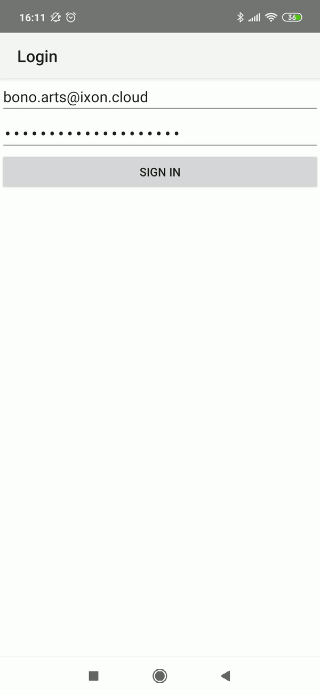
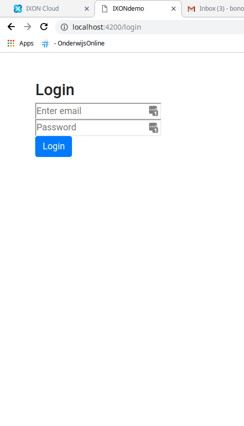

# IXON demo

This app is developed with Nativescript & Angular so front-end developers can build mobile and web apps with the api from IXON.
Find more info about it on their websites [here](https://www.nativescript.org/nativescript-is-how-you-build-native-mobile-apps-with-angular).

You can use this app as an example to examine how the requests are made to the IXON api. So you can eventually implement the IXON api in you're own application.

## Note
To make use of this application you will need a account from IXON, find more info about it on the official [IXON website](https://www.ixon.cloud/).

And Before you can use the app, you will need to request an application id from IXON.

You can do so by contacting [IXON Support](https://www.ixon.cloud/contact).

When you got the application id, you need to set it in /src/app/_services/ixon.service.

In the folder "withWidget" is the application with a widget build in. I worked my last hours on this widget but to keep the application simple I kept it apart. It is build in a different structure so you can't run it in a browser like this one.

These are just sample data
## Mobile

## Website

#Feature options
1. IOS should be fairly simple as nativesript has lots of support for it.
2. Generate a bitMap to show a graph on the widget.
3. Keep the user logged in, Simple but no priority.